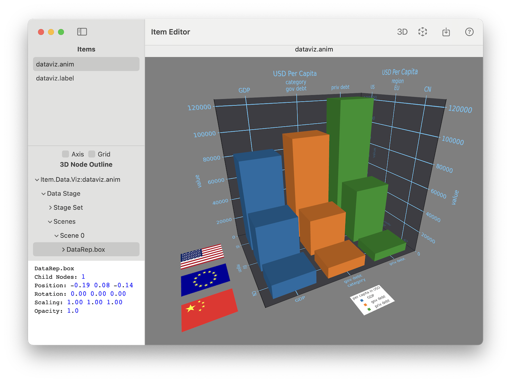

# ARchi

## ARchi VR App

The mobile ARchi VR application is an AR browser for iOS devices and supports the interactive presentation of SAXR data reps.

Samples of dynamic behavior:

* [Placing](Placing): __Auto-Placing__ of 3D chart using _Spatial Reasoning_
* [Animation](Animation): __Time Series__ controlled by _Animation_
* [Proximity](Proximity): __Level of Detail__ (LOD) controlled by _Proximity_
* [Storytelling](Storytelling): __Narrative Data Storytelling__ using _Interaction_

## ARchi Composer

ARchi Composer is a low-code editor for macOS to create dynamic and interactive AR content for the ARchi VR App using a declarative approach. 
ARchi Composer supports the visualization of data reps generated with `datarepgen.py`.

The data visualization can be exported to 3D files:
  - USDZ 3D samples: [iris.usdz](../samples/iris/result3D/iris.usdz), [eco.usdz](../samples/eco/result3D/eco.usdz), [fruits.usdz](../samples/fruits/result3D/fruits.usdz), [geo.usdz](../samples/geo/result3D/health.usdz)
  - glTF 3D samples: [iris.glb](../samples/iris/result3D/iris.glb), [eco.glb](../samples/eco/result3D/eco.glb), [fruits.glb](../samples/fruits/result3D/fruits.glb), [geo.glb](../samples/geo/result3D/health.glb)

## References

- App Web Page: https://archi.metason.net
- Apple App Store: https://apps.apple.com/ch/app/archi-vr-create-browse-ar/id1317896781
- Technical Documentation: https://service.metason.net/ar/docu/ 
- ARchi Composer Download: https://service.metason.net/ar/downloads/ARchiComposer.zip