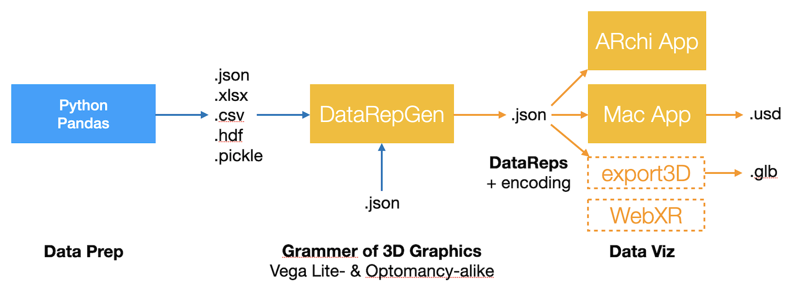

# SAXR: Situated Analytics in eXtended Reality



## Features

* __2D and 3D Plots__: Mix of 2D and 3D data plots
* __2D Plot → 3D Stage__: Spatial domain-range scaling aligned in 2D and 3D
* __2D Panels__: panels for stage boundaries and legends
* __DataReps__: list of simple DataRep elements for visual XR front-ends 
* __Grammer of Graphics__: Generation of aligned 2D/3D plots controlled by JSON specification
* __Python-based__: use of Pandas for data prep and of Matplotlib for 2D charts
* __Data Exploration in AR__: Immersive exploration of data in XR

## 3D Plot Layouts

* 3D bar charts
* 3D scatter plot
* 3D cluster: minmax category cluster with median   

   

## Situated Analytics in AR/XR front-end

List of DataRep scenes are interpreted as time series, level of details, or sequence in narrative 3D data viz.
* Proximity controls level of detail (LOD): https://youtu.be/UL8XRe5luu8
* Animation controls time series: https://youtube.com/shorts/PjelVMMz4Dk

[](https://youtu.be/UL8XRe5luu8) 
[](https://youtube.com/shorts/PjelVMMz4Dk) 
  
## Data Viz Scenery

- Data Viz *Stage* (stage : Bühne)
- Data Viz *Scenes*: indexed sequence based on same data
  - Data Viz *Scene*: own panels and own encodings
    - Stage *Set*: with panels (stage set : Bühnenbild, Legenden)
    - Data *Rep*: visual representation of data
- Panels
  - uppercase: on stage
  - lowercase: in scene
- auxreps

## Settings

Grammer of graphics to define 2D and 3D plots.

```json
{
    "description": "3D data viz of Iris data set.",
    "title": "Iris",
    "stage": {
        "width": 0.8,
        "height": 0.8,
        "depth": 0.8
    },
    "data": {
        "url": "../data/iris.json"
    },
    "assetURL": "$SERVER/run/vis/",
    "output": "viz.json",
    "gridcolor": "#DDDE00",
    "bgcolor": "#FFFFFF",
    "palette": {
        "metrical": "Blues",
        "temporal": "Greys",
        "ordinal": "Oranges",
        "nominal": "tab10"
    },
    "mark": "circle",
    "plot": "scatter",
    "encoding": {
        "x": {
            "field": "sepal width"
        },
        "y": {
            "field": "petal length"
        },
        "z": {
            "field": "petal width"
        },
        "size": {
            "value": 0.022
        },
        "color": {
            "field": "class",
            "title": "Iris Classes"
        },
        "opacity": {
            "value": 0.8
        }
    },
    "panels": [
        "xy",
        "-xy",
        "zy",
        "-zy",
        "xz",
        "lc=_"
    ]
}
```

### Color Palette

- palette
  - nominal: categorial color palette without ranking; default: 'tab10'
  - ordinal: categorial and sortable color palette; default: 'Oranges'
  - quantitative: numerical and interpolatable color palette; default: 'Blues'
  - temporal: quantitative and interpolatable color palette; default: 'Greys'

### DataRep

- shape: visual shape / mark?
  - shape of marker: 3D representation and equivalent 2D mark, with the goal of being recognizable view-independent in 3D and in 2D
    - 3D: sphere, box, pyramid, pyramid_down, octahedron, plus, cross
    - 2D: circle, square, triangle_up, triangle_down, diamond, plus, cross
    - plt: o, s, ^, v, D, P, X (Matplotlib symbols for 2D marks)
    - [star, dodecahedron, *]
  - shape of chart element
    - text: 
    - plane:
    - panel: see Panels
- x,y,z: position
- w,h,d: bbox size of shape
- size: bbox size with equal w, h, and d
- color: color of shape
- [label: text label ]
- [focus: content of focus panel, "tooltip" (text or rich text)]
- [link: URL link ]
- [rx,ry,rz: rotation --> not used due to not being view-independent for markers]

### Panels

- Data Stage Panels
  - xy: xy grid and axes
  - -xy: opposite xy plane with inverse x axis
  - zy: zy grid and axes
  - -zy: opposite zy plane with inverse z axis
  - xz: floor grid and axes
- Data Stage Panels + plotting
  - +l: line plot
  - +s: scatter plot
  - +b: bar blot
  - +a: area plot
  - +p: pie plot?
  - +c: category cluster showing min-max-mean using color encoding

- Legend Panels
  - lc: color legend
  - lm: marker legend (shape categories)
  - ls: size legend (size categories)
- Legend Panels pose
  - = flat
  - | upright
  - ! upright billboarding
- Legend Panels position
  - x dir: <>
  - y dir: v^
  - z dir: _-

### Mark / Plot (Layout)
- point / scatter
- circle / scatter 
- line / line
- bar / bar
- area
- text

## References

- https://github.com/vega/vega-lite
- https://github.com/vega/vega-datasets
- https://github.com/Wizualization/optomancy

## Samples

https://vega.github.io/vega-lite/examples/stacked_bar_weather.html 

## DATA
Economics
https://data.worldbank.org/indicator/FS.AST.PRVT.GD.ZS?locations=EU
https://www.macrotrends.net/global-metrics/countries/chn/china/gdp-per-capita

Source: https://en.wikipedia.org/wiki/Economy_of_the_European_Union
https://www.kaggle.com/
CH: https://opendata.swiss/de

https://stats.swiss/vis?lc=de&df[ds]=disseminate&df[id]=DF_COU_HEALTH_COSTS&df[ag]=CH1.COU&df[vs]=1.0.0&dq=_T._T.M_1%2BM_2._T._T._T.4%2B5%2B6%2B7%2B8%2B9%2B10%2B11%2B12%2B13%2B14%2B15%2B16%2B17%2B18%2B19%2B20%2B21%2B22%2B23%2B24%2B25%2B26%2B3%2B2%2B1.CHF_R_POP_R_MH.A&lom=LASTNPERIODS&lo=1&to[TIME_PERIOD]=false&vw=ov

https://swiss-maps.interactivethings.io


## VIDEOS
irisLOD: https://youtu.be/UL8XRe5luu8

ecoANIM: https://youtube.com/shorts/PjelVMMz4Dk
