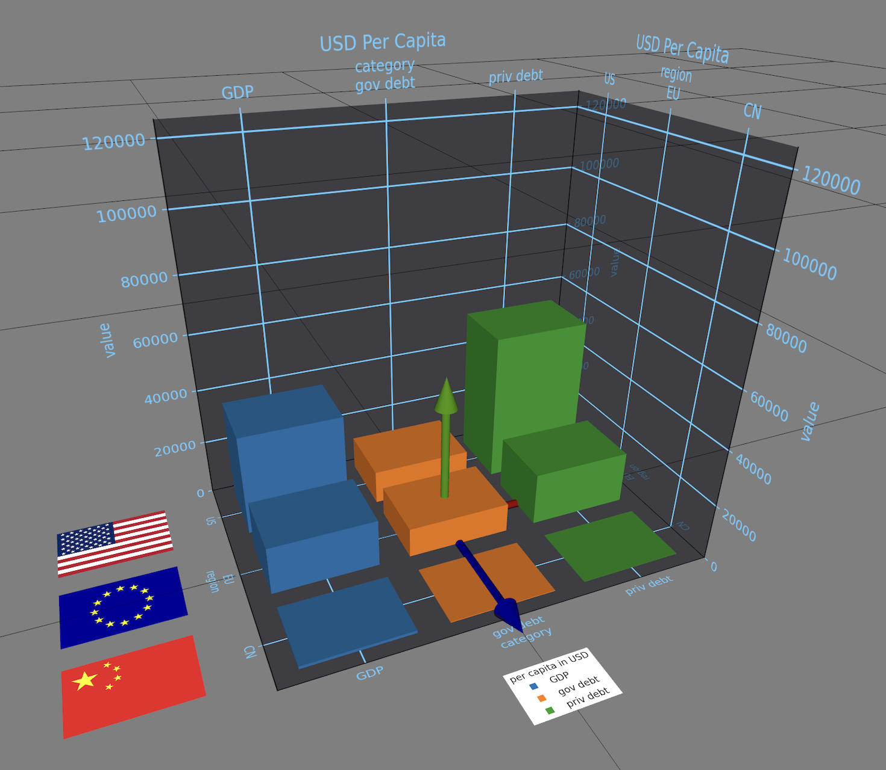

# SAXR: Situated Analytics in eXtended Reality


## Features

* __Situated Analytics in XR/AR/VR__: Immersive data exploration in eXtended Reality
* __2D and 3D Plots__: Mix of 2D and 3D data plots in combined charts
* __2D Plot → 3D Stage__: Spatial domain-range scaling aligned in 2D and 3D
* __Image Panels__: Panels for stage boundaries and legends
* __Data Reps__: List of simple data representations for visual XR front-ends 
* __Grammar of 3D Graphics__: Generation of aligned 2D/3D plots controlled by declarative JSON specification
* __Data Prep__: Use of Numpy, Pandas and GeoPandas as most common tools  for data processing
* __Python-based__: Scripts for generation of data reps using Matplotlib for chart layouting
* __Data Import__: Inline data specification or loading of data files in json/xlsx/csv format

## 3D Plot Layouts

* 3D __bar__ chart as in [samples/eco/settings.json](samples/eco/settings.json)
* 3D __scatter__ plot as in [samples/iris/settings.json](samples/irs/settings.json)
* 3D __cluster__: min-max cluster per category with median   
* 3D __pie__ chart: mixed 2D/3D donut chart as in [samples/fruits/settings.json](samples/fruits/settings.json)
* 3D __map__: grouped bar chart on map as in [samples/geo/settings.json](samples/geo/settings.json)

    

## Situated Analytics in AR/XR Front-end

List of DataRep scenes are interpreted as level of details, time series, or sequence in narrative 3D data viz. See screen recoding videos run within the [ARchi VR](https://archi.metason.net) app:  
* Proximity controls level of detail (LOD): https://youtu.be/UL8XRe5luu8
* Animation controls time series: https://youtube.com/shorts/PjelVMMz4Dk

[](https://youtu.be/UL8XRe5luu8) 
[](https://youtube.com/shorts/PjelVMMz4Dk) 

## Installation

- Prerequisite: Python 3.X
- Install Pandas and Matplotlib (and optionally GeoPandas)
- Download repository
- In project folder run: ```python3 datarepgen.py samples/iris``` 
  - the python script reads the ```samples/iris/settings.json``` file as input 
- Find generated output in ```samples/iris``` folder: 
  - several 2D images in png format
  - encoding.json
  - a list of data reps in viz.json (used as input for XR viewer)

## Data Viz Scenery

In SAXR 2D and 3D elements are arranged in a Data Viz Scenery consisting of:
- Data Viz *Stage*: with consistent dimension for all scenes
- Data Viz *Scenes*: indexed sequence of:
  - Data Viz *Scene*: with panels and own encodings
    - Stage *Set*: with panels
    - Data *Reps*: visual representations of data

## Declarative Specification with Grammar of Graphics

SAXR is supporting a high-level grammar of graphics to define 2D and 3D sceneries in a JSON settings file. It is heavily inspired by [Vega-Lite](https://github.com/vega/vega-lite) and [Optomancy](https://github.com/Wizualization/optomancy). The specifications in the JSON settings file serves as input to the ```datarepgen.py```script that generates data reps and corresponding images used as assets for panels.

Example of a settings.json file:

```json
{
    "description": "3D data viz of Iris data set.",
    "title": "Iris",
    "stage": {
        "width": 0.8,
        "height": 0.8,
        "depth": 0.8
    },
    "data": {
        "url": "../data/iris.json"
    },
    "assetURL": "$SERVER/run/vis/",
    "output": "viz.json",
    "background": "#FFFFFF",
    "gridColor": "#DDDE00",
    "plot": "scatter",
    "mark": "sphere",
    "encoding": {
        "x": {
            "field": "sepal width"
        },
        "y": {
            "field": "petal length"
        },
        "z": {
            "field": "petal width"
        },
        "size": {
            "value": 0.022
        },
        "color": {
            "field": "class",
            "title": "Iris Classes"
        }
    },
    "panels": [
        "xy",
        "-xy",
        "zy",
        "-zy",
        "xz",
        "lc=_"
    ]
}
```

### Data Reps

Data Reps are a collection of simple represenations of data elements that will be visualized in the XR front-end application. They are encoded as JSON file:

```json
[
  {
    "type": "-XY",
    "x": 0.0, "y": -0.014, "z": 0.319,
    "w": 1.193, "d": 0, "h": 0.567,
    "asset": "$SERVER/run/vis/-xy.png"
  },
  {
    "type": "cylinder",
    "x": 0.0707, "y": 0.0834, "z": -0.2028,
    "w": 0.0151, "h": 0.1669, "d": 0.015,
    "color": "blue"
  },
  ...
]
```

- type: visual shape or panel type
  - shape of marker: 3D representation and equivalent 2D mark, with the goal of being recognizable view-independent in 3D and in 2D
    - 3D: sphere, box, pyramid, pyramid_down, octahedron, plus, cross
    - 2D: circle, square, triangle_up, triangle_down, diamond, plus, cross
    - plt: o, s, ^, v, D, P, X (Matplotlib symbols for 2D marks)
  - shape of chart element
    - cylinder: for bar plots (instead of box)
    - plane: for flat overlays on panels
    - image: for placing any icon or image
    - text: for labels
  - panel type (see next chapter)
- x,y,z: position
- w,h,d: bbox size of shape
  - if h == 0 and d > 0 then shape is flat
  - if d == 0 and h > 0 then shape is upright
- color: color of shape
  - hex-coded colors (e.g., "#FF0000"), also with transparency (e.g.,"#FF0000AA")
  - color names (e..g., "blue")
- asset 
  - URL to remote file (e.g., to image file)
  - text
  - attributes

### Panels

Panel types are encoded by their name. If panel name is uppercase it will be presented as stage element, if lowercase as scene element.

- Data Stage Panels
  - xy: xy grid and axes
  - -xy: opposite xy plane with inverse x axis
  - zy: zy grid and axes
  - -zy: opposite zy plane with inverse z axis
  - xz: floor grid and axes
- Data Stage Panels + plotting
  - +s: scatter plot
  - +p: pie/donut chart
- Examples of Data Stage Panels:
  - ```"xy", "-xy", "xy+s", "XY", "ZY", "XZ+p"...```


Legends are panels as well. The legend name additionally encodes its position.

- Legend Panels
  - lc: color legend
  - lm: marker legend (shape categories)
  - ls: size legend (size categories)
  - lg: group legend (group fields mapped to colors)
- Legend Panels pose
  - = flat
  - | upright
  - ! upright and billboarding
- Legend Panels position
  - x position: 
    - \< leftside
    - \> rightside
    - default: mid
  - y position: 
    - v bottom
    - ^ top
    - default: mid
  - z position:
    -  _ front
    -  - mid
 -  Examples of Legend Panels: 
    - ```"lc", "lc=_", "lc=_<", "LC", "LC=_", "lg=_>", ...```

### Color Palettes

Predefined Color Palettes:
- __nominal__: categorial color palette without ranking; default: 'tab10'
- __ordinal__: categorial and sortable color palette; default: 'Oranges'
- __quantitative__: quantitative and interpolatable color palette; default: 'Blues'
- __temporal__: quantitative and interpolatable color palette; default: 'Greys'

The color palettes may be overwritten in the settings.json file. 
All [colormaps](https://matplotlib.org/stable/gallery/color/colormap_reference.html) defined in Matplotlib can be used.

```json
    "palette": {
        "nominal": "tab10",
        "ordinal": "Oranges",
        "quantitative": "Blues",
        "temporal": "Greys"
    },
```

## Screen Recording Videos
- irisLOD: https://youtu.be/UL8XRe5luu8
- ecoANIM: https://youtube.com/shorts/PjelVMMz4Dk

## References

- https://github.com/vega/vega-lite
- https://github.com/vega/vega-datasets
- https://github.com/Wizualization/optomancy
- https://matplotlib.org/stable/gallery/color/colormap_reference.html