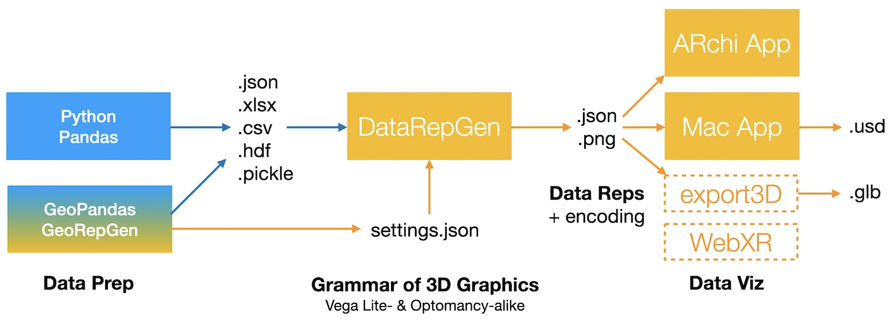
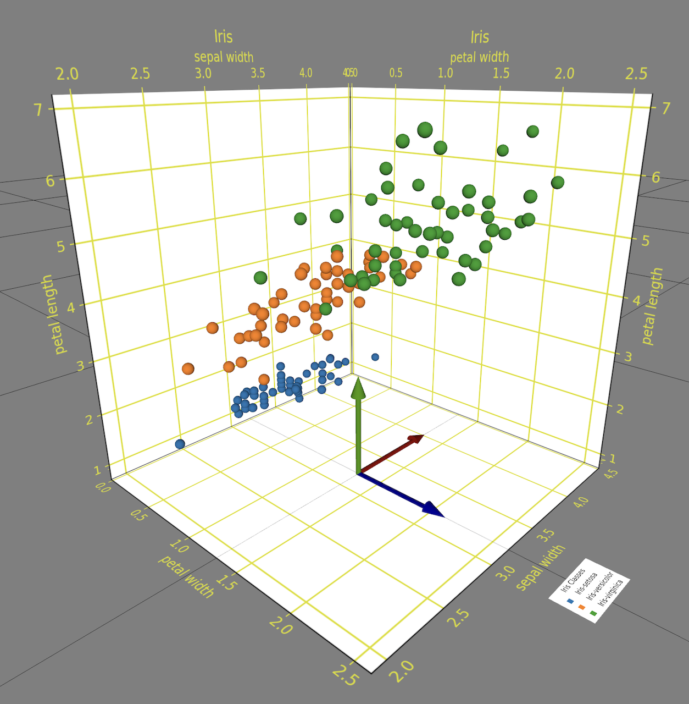

# SAXR: Situated Analytics in eXtended Reality



## Features

* __Situated Analytics in XR/AR/VR__: Immersive data exploration in eXtended Reality
* __2D and 3D Plots__: Mix of 2D and 3D data plots in combined charts
* __2D Plot → 3D Stage__: Spatial domain-range scaling aligned in 2D and 3D
* __Image Panels__: Panels for stage boundaries and legends
* __Data Reps__: List of simple data representations for visual XR front-ends 
* __Grammar of 3D Graphics__: Generation of aligned 2D/3D plots controlled by declarative JSON specification
* __Data Prep__: Use of Numpy, Pandas and GeoPandas as most common tools  for data processing
* __Python-based__: Scripts for generation of data reps using Matplotlib for chart layouting
* __Data Import__: Inline data specification or loading of data files in json/xlsx/csv format

## 3D Plot Layouts

Data visualization generated with `datarepgen.py`:
* 3D __bar__ chart as in [samples/eco/settings.json](samples/eco/settings.json)
* 3D __scatter__ plot as in [samples/iris/settings.json](samples/irs/settings.json)
* 3D __cluster__: min-max cluster per category with median   
* 3D __pie__ chart: mixed 2D/3D pie/donut chart as in [samples/fruits/settings.json](samples/fruits/settings.json)
* 3D __map__: grouped bar chart on map as in [samples/geo/settings.json](samples/geo/settings.json) using `georepgen.py`

    

## Data Viz Scenery

In SAXR 2D and 3D elements are arranged in a Data Viz _Scenery_ consisting of:
- Data Viz *Stage* with consistent dimensions in 2D and 3D
  - Stage *Set* with global panels and spatial encodings
- Data Viz *Scenes* as indexed sequence of:
  - Data Viz *Scene* with local panels and encodings
  - Data *Reps* as visual representations of data
  
## Behavior of Situated Analytics in AR/XR Front-end
List of scenes (containing DataReps) are interpreted as level of details, time series, or sequence in narrative 3D data viz. They become interactive by embedding SAXR data visualization into dynamic AR experiences controlled by declarative scripts. 

See declarations of behavior and screen recoding videos run within the [ARchi VR](https://archi.metason.net) app. The behavior of SAXR data viz in the ARchi VR App is documented as Event-Condition-Action (ECA) diagrams:  
* [__Auto-Placing__](ARchi/Placing/) of geo chart using _Spatial Reasoning_: https://youtube.com/shorts/6w4DJwMHewY
* [__Level of Detail__](ARchi/Proximity/) (LOD) controlled by _Proximity_: https://youtu.be/UL8XRe5luu8
* [__Time Series__](ARchi/Animation/) controlled by _Animation_: https://youtube.com/shorts/PjelVMMz4Dk
* [__Narrative Data Storytelling__](ARchi/Storytelling/) using _Interaction_: https://youtube.com/shorts/85cTH27r540
 
[](https://youtube.com/shorts/6w4DJwMHewY) [](https://youtu.be/UL8XRe5luu8) [](https://youtube.com/shorts/PjelVMMz4Dk) [](https://youtube.com/shorts/85cTH27r540) 


## Declarative Specification with Grammar of Graphics

SAXR is supporting a high-level grammar of graphics to define 2D and 3D sceneries in a JSON settings file. It is heavily inspired by [Vega-Lite](https://github.com/vega/vega-lite) and [Optomancy](https://github.com/Wizualization/optomancy). The specifications in the JSON settings file serves as input to the ```datarepgen.py```script that generates data reps and corresponding images used as assets for panels.

Example of a settings.json file:

```json
{
    "description": "3D data viz of Iris data set.",
    "title": "Iris",
    "stage": {
        "width": 0.8,
        "height": 0.8,
        "depth": 0.8
    },
    "data": {
        "url": "../data/iris.json"
    },
    "assetURL": "$SERVER/run/vis/",
    "output": "viz.json",
    "background": "#FFFFFF",
    "gridColor": "#DDDE00",
    "plot": "scatter",
    "mark": "sphere",
    "encoding": {
        "x": {
            "field": "sepal width"
        },
        "y": {
            "field": "petal length"
        },
        "z": {
            "field": "petal width"
        },
        "size": {
            "value": 0.022
        },
        "color": {
            "field": "class",
            "title": "Iris Classes"
        }
    },
    "panels": [
        "xy",
        "-xy",
        "zy",
        "-zy",
        "xz",
        "lc=_"
    ]
}
```

## Data Reps

Data Reps are a collection of simple representations of data elements that will be visualized in the XR front-end application. They are encoded as JSON file, such as:

```json
[
  {
    "type": "-XY",
    "x": 0.0, "y": -0.014, "z": 0.319,
    "w": 1.193, "d": 0, "h": 0.567,
    "asset": "$SERVER/run/vis/-xy.png"
  },
  {
    "type": "cylinder",
    "x": 0.0707, "y": 0.0834, "z": -0.2028,
    "w": 0.0151, "h": 0.1669, "d": 0.015,
    "color": "blue"
  }
]
```

The data fields of Data Reps are:
- __type__: visual shape or panel type
  - shape of marker: 3D representation and equivalent 2D mark, with the goal of being recognizable view-independent in 3D and in 2D
    - 3D: sphere, box, pyramid, pyramid_down, octahedron, plus, cross
    - 2D: circle, square, triangle_up, triangle_down, diamond, plus, cross
    - plt: `o, s, ^, v, D, P, X` (Matplotlib symbols for 2D marks)
  - shape of chart element
    - cylinder: for bar plots (instead of box)
    - plane: for flat overlays on panels
    - image: for placing any icon or image
    - text: for labels
  - panel type (see next chapter)
- __x,y,z__: position
- __w,h,d__: bbox size of shape
  - if h == 0 and d > 0 then shape is flat
  - if d == 0 and h > 0 then shape is upright
- __color__: color of shape
  - hex-encoded RGB color (e.g., "#FF0000"), with support for transparency (e.g.,"#FF0000AA")
  - color name (e..g., "blue")
- __asset__: type-specific resources 
  - URL to file (e.g., to image file)
  - text (for labels)
  - attributes (e.g, `"angle:45;start:90"` for arc)

## Panels

Panel types are encoded by their name. If panel name is uppercase it will be presented as stage element, if lowercase as scene element.

- Data Stage Panels
  - `xy`: xy grid and axes
  - `-xy`: opposite xy plane with inverse x axis
  - `zy`: zy grid and axes
  - `-zy`: opposite zy plane with inverse z axis
  - `xz`: floor grid and axes
- Data Stage Panels + plotting
  - `+s`: scatter plot
  - `+p`: pie/donut chart
- Examples of Data Stage Panel specifications:
  - ```"xy", "-xy", "xy+s", "XY", "ZY", "XZ+p"...```
- Samples of generated image plots (from the [samples/iris](samples/iris/) project):
  - [xz+s](https://service.metason.net/ar/content/viz/irisLOD/xz+s.png), [xy.png](https://service.metason.net/ar/content/viz/irisLOD/xy.png), [-xy.png](https://service.metason.net/ar/content/viz/irisLOD/-xy.png), [zy.png](https://service.metason.net/ar/content/viz/irisLOD/zy.png), [-zy.png](https://service.metason.net/ar/content/viz/irisLOD/-zy.png)

Legends are panels as well. The legend name additionally encodes its pose and position.

- Legend Panels
  - `lc`: color legend
  - `lm`: marker legend (shape categories)
  - `ls`: size legend (size categories)
  - `lg`: group legend (group fields mapped to colors)
- Legend Panels pose
  - `=` flat
  - `|` upright
  - `!` upright and billboarding
- Legend Panels position
  - x position: 
    - `<` leftside
    - `>` rightside
    - default: mid
  - y position: 
    - `v` bottom
    - `^` top
    - default: mid
  - z position:
    - `_` front
    - `-` mid
-  Examples of Legend Panel specifications: 
    - ```"lc", "lc=_", "lc=_<", "LC", "LC=_", "lg=_>", ...```
- Samples of generated legend images:
  - discrete [lc.png](https://service.metason.net/ar/content/viz/irisLOD/lc.png), continuous [lc.png](https://service.metason.net/ar/content/viz/salesSTORY/lc.png), [lg.png](https://service.metason.net/ar/content/viz/geoSPATIAL/lg.png), [lm.png](docu/images/lm.png)


## Color Palettes

Predefined Color Palettes:
- __nominal__: categorial color palette without ranking; default: `tab10`
- __ordinal__: categorial and sortable color palette; default: `Oranges`
- __quantitative__: quantitative and interpolatable color palette; default: `Blues`
- __temporal__: quantitative and interpolatable color palette; default: `Greys`

The color palettes may be overwritten in the `settings.json` file. 
All [colormaps](https://matplotlib.org/stable/gallery/color/colormap_reference.html) defined by Matplotlib can be used in SAXR settings.

```json
    "palette": {
        "nominal": "tab10",
        "ordinal": "Oranges",
        "quantitative": "Blues",
        "temporal": "Greys"
    },
```

## Installation

- Prerequisite: Python 3.X
- Install Pandas and Matplotlib (and optionally GeoPandas)
- Download repository
- In project folder run: ```python3 datarepgen.py samples/iris``` 
  - the python script reads the ```samples/iris/settings.json``` file as input 
- Find generated output in ```samples/iris``` folder: 
  - several 2D images in png format (used for panels)
  - encoding.json
  - a list of data reps in viz.json (used as input for XR viewer)

## SAXR Front-ends

The presentation of SAXR data reps is supported by:

- [ARchi VR App](ARchi): iOS AR application
- [ARchi Composer](ARchi): macOS AR editor
  - USDZ 3D samples: [iris.usdz](samples/iris/result3D/iris.usdz), [eco.usdz](samples/eco/result3D/eco.usdz), [fruits.usdz](samples/fruits/result3D/fruits.usdz), [geo.usdz](samples/geo/result3D/health.usdz)
  - glTF 3D samples: [iris.glb](samples/iris/result3D/iris.glb), [eco.glb](samples/eco/result3D/eco.glb), [fruits.glb](samples/fruits/result3D/fruits.glb), [geo.glb](samples/geo/result3D/health.glb)

## Hints

How to fix transparency in USDZ/glTF export:
- Export USD from ARchi Composer
- Import file into Blender
  - Select planes with texture images using opacity/transparency
    - In Shading editor connect alpha from image to Principled BSDF
    - In Material tab
      - set Settings->Blend Mode to "Alpha Clip"
      - set Backface Culling on
- Delete Camera and Light from Scene
- Export to usdz and glb format (does embed textures)

## Screen Recording Videos
- geoSPATIAL: https://youtube.com/shorts/6w4DJwMHewY
- irisLOD: https://youtu.be/UL8XRe5luu8
- ecoANIM: https://youtube.com/shorts/PjelVMMz4Dk
- salesSTORY: https://youtube.com/shorts/85cTH27r540

## References

- Optomancy: https://github.com/Wizualization/optomancy
- Vega-lite: https://github.com/vega/vega-lite
- Datasets: https://github.com/vega/vega-datasets
- Colormaps: https://matplotlib.org/stable/gallery/color/colormap_reference.html
- ARchi VR App: https://archi.metason.net